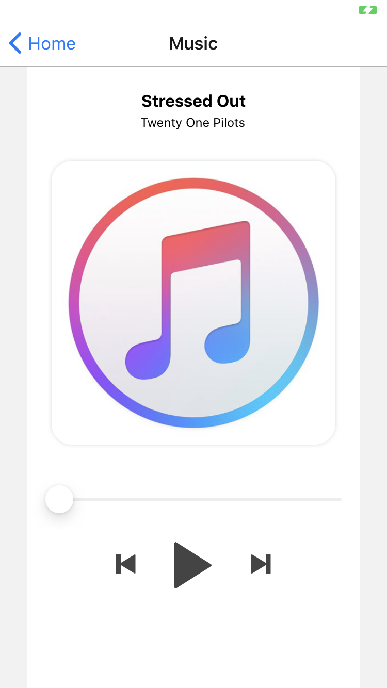

# React Native Audio Player for managed Expo

This is a simple Audio Player for those who use Expo.

It's pretty barebone right now. Just enough to be used
This is developed from https://github.com/aakashns/reactmusic



## Usage

```
import React, { Component } from 'react';
...
const TRACKS = [
  {
    title: 'Stressed Out',
    subtitle: 'Twenty One Pilots',
    albumArtUrl: "https://cdn-images-1.medium.com/max/1344/1*fF0VVD5cCRam10rYvDeTOw.jpeg",
    audioUrl: "https://ia800204.us.archive.org/11/items/hamlet_0911_librivox/hamlet_act1_shakespeare.mp3"
  },
  {
    title: 'Stressed Out',
    subtitle: 'Twenty One Pilots',
    albumArtUrl: "https://cdn-images-1.medium.com/max/1344/1*fF0VVD5cCRam10rYvDeTOw.jpeg",
    audioUrl: "https://ia600204.us.archive.org/11/items/hamlet_0911_librivox/hamlet_act5_shakespeare.mp3"
  }
];
return <Player tracks={TRACKS} displayArt={true}/>

```


## Todo

- [x] Basic Music Player
- [ ] Forward and Backward
- [ ] Repeat
- [ ] Shuffle
